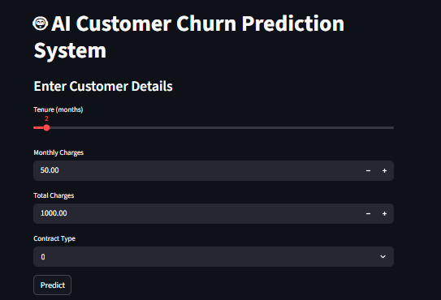
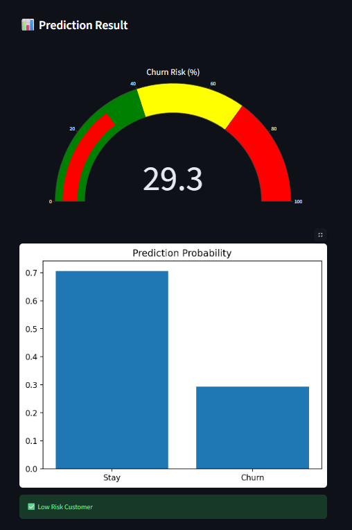
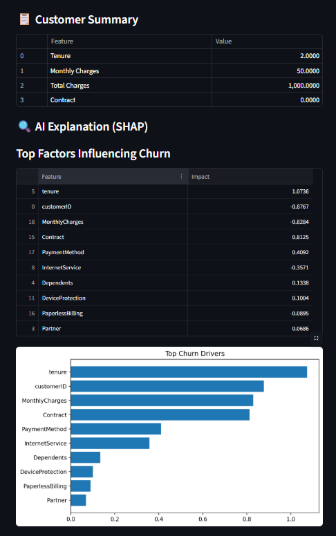
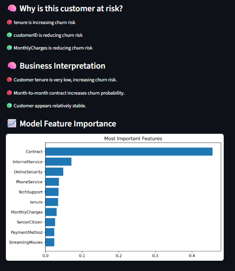

# SignalGraph Churn Intelligence Platform

## Application Screenshots

### Customer Input Dashboard

### Churn Prediction & Risk Analysis

### Explainable AI (SHAP) Analysis

### Model Feature Importance

## Project Overview

SignalGraph Churn Intelligence Platform is an end-to-end machine learning solution designed to identify customers at risk of churn and recommend proactive retention strategies.

The platform combines predictive analytics, Explainable AI (SHAP), and interactive visualizations to help businesses understand churn drivers, prioritize high-risk customers, and improve customer retention outcomes.

Key capabilities include:

- Customer churn prediction
- Risk categorization
- SHAP-based explainability
- Feature importance analysis
- Retention recommendation engine
- Interactive Streamlit dashboard
